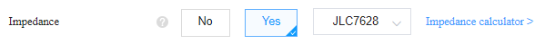

# Electret microphone PCB

## Description

This microphone project consist of an electret microphone capsule wired to a home-made USB sound card based on a TS972 dual low noise op-amp and a STM32F446RET6 microcontroller.

## Software

More about the software for this microphone [here](https://github.com/Vaarai/USB_Microphone_software).

## Hardware

The PCB was designed with [Altium Designer](https://www.altium.com/) and printed by [JLCPCB](https://jlcpcb.com/). 

Want to reproduce this design but don't want / can't open an Altium project ? 

Don't worry, all you needs is to download the latest [release](https://github.com/Vaarai/USB_Microphone/releases) on this repo.

### PCB Bill of material

- MCU : [STM32F446RET6](https://www.st.com/en/microcontrollers-microprocessors/stm32f446re.html)
- AOP : [TS972IDT](https://www.st.com/en/amplifiers-and-comparators/ts972.html)
- LDO : [MIC5504-3.3YMT](https://www.microchip.com/en-us/product/MIC5504)
- USB : [GCT-USB4105](https://gct.co/fr/connector/usb4105)
- OSC : [NX5032GA-16MHZ-STD-CSK-4](https://www.ndk.com/images/products/catalog/c_NX5032GA_e.pdf)
- ESD : [ESDA6V1BC6](https://www.st.com/en/protections-and-emi-filters/esda6v1bc6.html)
- MIC : [JLI-2555BXZ3-GP](https://www.jlielectronics.com/microphone-capsules/jli-2555bxz3-gp/)
- Some resistors/capacitors (for more info please refer to the board schematic)

### How to print the PCB

Firstly, this PCB carry an USB communication, due to the high speed of this protocol the PCB need to follow some rules.
To avoid you the calculation of these rules I strongly recommend you to use JLCPCB as manufacturer and follow the tutorial below.

If you don't want to modify the design, skip "Generating the fabrication files"

#### Generating the fabrication files
- You can modify the layout of the PCB, just take care about the USB differential pair.
- Follow [this tutorial](https://support.jlcpcb.com/article/42-how-to-export-altium-pcb-to-gerber-files) to export the fabrication files once you've modified the design
- Continue with the steps below

#### Ordering the PCB at JLCPCB : 
- Go to [JLCPCB](https://jlcpcb.com/) and upload the .zip file
- In the PCB parameters set "Impedance" to "Yes" and select "JLC7628"

- You can set the PCB color and leave all other parameters by default
- Proceed to checkout

### Galery

