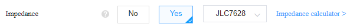
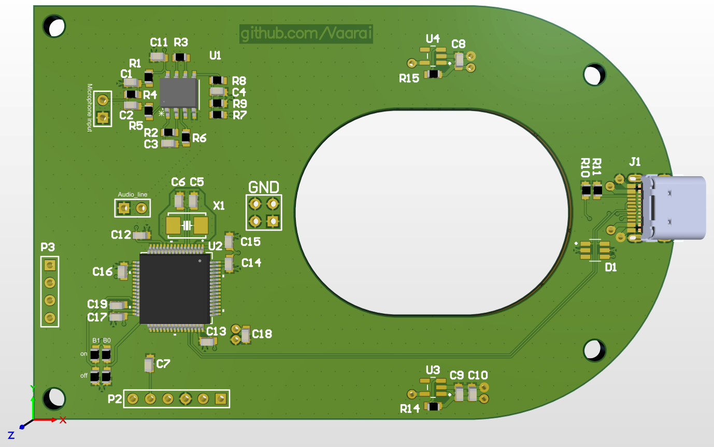
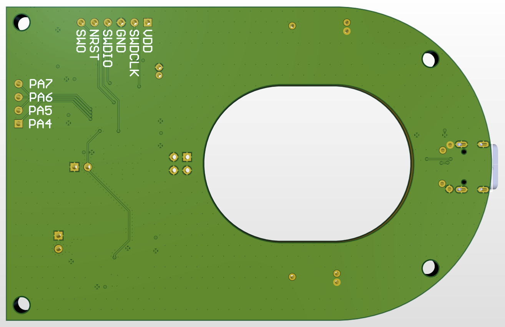
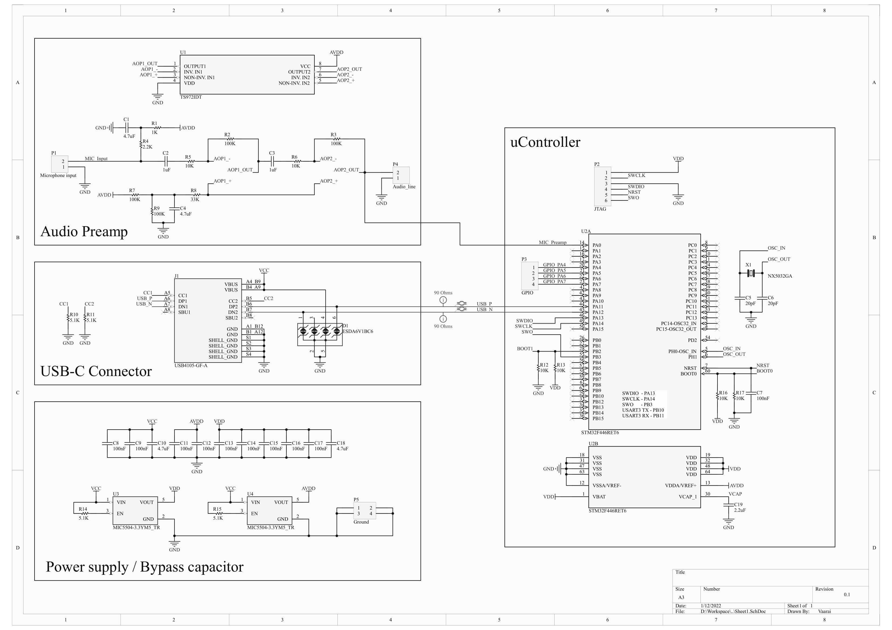

# Electret microphone PCB

## Description

This microphone project consist of an electret microphone capsule wired to a home-made USB sound card based on a TS972 dual low noise op-amp and a STM32F446 microcontroller.

## Software

Work in progress !!!

## Hardware

The PCB was designed with [Altium Designer](https://www.altium.com/) and printed by [JLCPCB](https://jlcpcb.com/). 

Want to reproduce this design but don't have an Altium license ? 

Don't worry, all necessary fabrication files are located in the [Output (WIP)](./Output) directory.

### PCB Bill of material

- MCU : [STM32F446RET6](https://www.st.com/en/microcontrollers-microprocessors/stm32f446re.html)
- AOP : [TS972IDT](https://www.st.com/en/amplifiers-and-comparators/ts972.html)
- LDO : [MIC5504-3.3YMT](https://www.microchip.com/en-us/product/MIC5504)
- USB : [GCT-USB4105](https://gct.co/fr/connector/usb4105)
- OSC : [NX5032GA-16MHZ-STD-CSK-4](https://www.ndk.com/images/products/catalog/c_NX5032GA_e.pdf)
- ESD : [ESDA6V1BC6](https://www.st.com/en/protections-and-emi-filters/esda6v1bc6.html)
- MIC : [JLI-2555BXZ3-GP](https://www.jlielectronics.com/microphone-capsules/jli-2555bxz3-gp/)
- Some resistors/capacitors (for more info please refer to the board schematic)

### How to print the PCB

Work in progress !!!

Estimated price : 8€ (without shipping fees)

If you don't want to modify the design, skip "Generating the fabrication files"

#### Generating the fabrication files
- Follow [this tutorial](https://support.jlcpcb.com/article/42-how-to-export-altium-pcb-to-gerber-files) to export the fabrication files once you've modified the design
- Continue with the steps below

#### Ordering the PCB at JLCPCB : 
- Go to [JLCPCB](https://jlcpcb.com/) and upload the .zip file
- In the PCB parameters set "Impedance" to "Yes" and select "JLC7628"

- You can set the PCB color and leave all other parameters by default
- Proceed to checkout

### Galery

